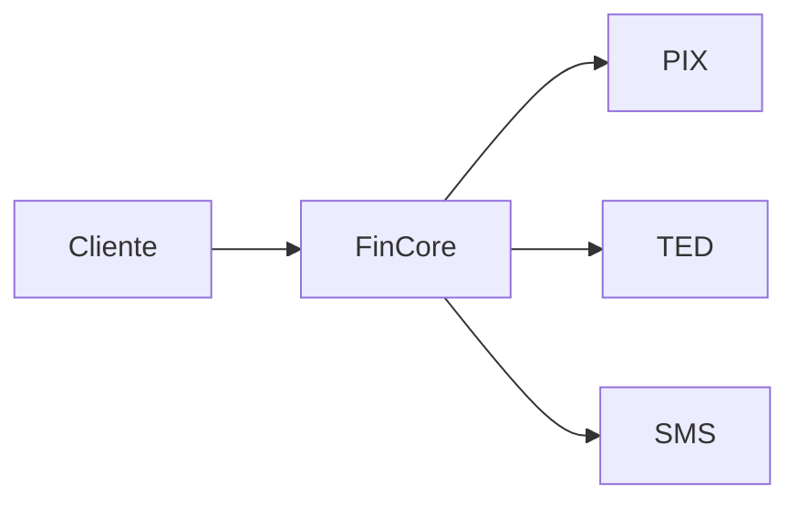

# Arquitetura inicial

A equipe anterior declarou que o FinCore utiliza "microsserviços", porém todo o código entregue está no mesmo módulo e compartilha diretamente objetos internos.

Não há registro dos critérios usados para selecionar o estilo arquitetural.
