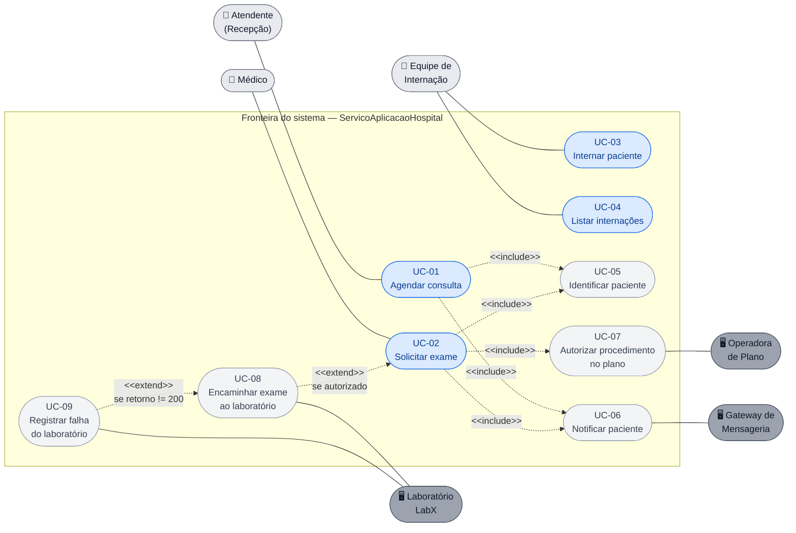

# Casos de uso - ServicoAplicacaoHospital

Classe escolhida: **`ServicoAplicacaoHospital`**
(`src/main/java/br/edu/mediconnect/servico/ServicoAplicacaoHospital.java`).

Ela é a fachada de aplicação do MediConnect: todo caso de uso do sistema hoje entra por um
de seus quatro métodos públicos. Por isso a fronteira do diagrama é a própria classe.

## Mapeamento caso de uso → método

| UC | Caso de uso | Método da classe | Ator primário |
| --- | --- | --- | --- |
| UC-01 | Agendar consulta | `agendar(Consulta)` | Atendente |
| UC-02 | Solicitar exame | `solicitarExame(SolicitacaoExame, double)` | Médico |
| UC-03 | Internar paciente | `internar(String, String, String)` | Equipe de internação |
| UC-04 | Listar internações | `listarInternacoes()` | Equipe de internação |
| UC-05 | Identificar paciente | `pacientes.buscar(id)` (incluído) | — |
| UC-06 | Notificar paciente | `notificacoes.notificar(...)` (incluído) | — |
| UC-07 | Autorizar procedimento | `apiPlanoSaude.autorizarProcedimento(...)` | Operadora (secundário) |
| UC-08 | Encaminhar exame ao laboratório | `clienteLab.enviarExame(...)` | LabX (secundário) |
| UC-09 | Registrar falha do laboratório | `status = "LAB_ERROR"` | LabX (secundário) |

---

## UC-01 — Agendar consulta

- **Ator primário:** Atendente da recepção
- **Pré-condição:** paciente cadastrado em `RepositorioPacientesEmMemoria`
- **Pós-condição (sucesso):** consulta salva com `status = "SCHEDULED"` e e-mail disparado

**Fluxo principal**

1. O atendente informa os dados da consulta (id, paciente, médico, data/hora, tipo).
2. O sistema busca o paciente pelo id.
3. O sistema marca a consulta como `SCHEDULED`.
4. O sistema persiste a consulta no repositório.
5. O sistema notifica o paciente por e-mail. *(include UC-06)*
6. O sistema retorna sucesso.

**Fluxo alternativo A1 — paciente inexistente**
2a. O repositório retorna `null` → o sistema retorna `false` sem mensagem de erro e encerra.

**Lacunas conhecidas** (marcadas como "problema intencional" no código, `ServicoAplicacaoHospital:41`)

- Não valida se o médico existe nem se tem a especialidade adequada.
- Não verifica conflito de horário na agenda do médico.
- Não verifica duplicidade de consulta.
- Não valida o formato de `dataHora` (`String` livre).

## UC-02 — Solicitar exame

- **Ator primário:** Médico
- **Atores secundários:** Operadora de plano, LabX, Gateway de mensageria
- **Pré-condição:** paciente cadastrado
- **Pós-condição:** `SolicitacaoExame` com status `SENT_TO_LAB`, `LAB_ERROR` ou `DENIED`

**Fluxo principal**

1. O médico solicita o exame informando código e custo estimado.
2. O sistema identifica o paciente. *(include UC-05)*
3. O sistema pede autorização à operadora. *(include UC-07)*
4. A operadora autoriza (resposta terminada em `OK`).
5. O sistema encaminha o exame ao LabX. *(extend UC-08)*
6. O LabX responde `200`; o status vira `SENT_TO_LAB`.
7. O sistema notifica o paciente por WhatsApp. *(include UC-06)*

**Fluxos alternativos**

| Id | Condição | Comportamento atual | Problema |
| --- | --- | --- | --- |
| A1 | Paciente inexistente | Retorna `false` | Indistinguível de "não autorizado" |
| A2 | Operadora responde `MANUAL` | Status `DENIED`, retorna `false` | Perde o estado "em análise manual" |
| A3 | LabX responde `400` | Status `LAB_ERROR`, **retorna `true`** | Falha reportada como sucesso |
| A4 | Operadora ou LabX indisponível | Exceção propaga | Sem timeout, retry ou fallback |

## UC-03 — Internar paciente

- **Ator primário:** Equipe de internação
- **Fluxo principal:** a equipe informa id, paciente e quarto; o sistema cria a `Internacao`
  com `status = "ACTIVE"` e a adiciona à lista interna.
- **Lacunas** (`ServicoAplicacaoHospital:79`): não valida existência do paciente, não verifica
  ocupação do quarto, não persiste em repositório e não notifica ninguém.

## UC-04 — Listar internações

- **Ator primário:** Equipe de internação
- **Fluxo principal:** o sistema devolve as internações registradas.
- **Lacuna:** devolve a **lista interna mutável** (`return internacoes`), permitindo que o
  chamador altere o estado do serviço; não há filtro por status nem paginação.

---

## Rastreabilidade

Registrar em `docs/requisitos/rastreabilidade.md` a ligação UC-01..UC-04 ↔ requisitos funcionais
↔ testes. Diagramas relacionados: [classes](../classes/classes-atual.md),
[contexto](../contexto/contexto-atual.md),
[sequência - exame](../sequencia/solicitacao-exame.md),
[sequência - agendamento](../sequencia/agendamento-consulta.md).
