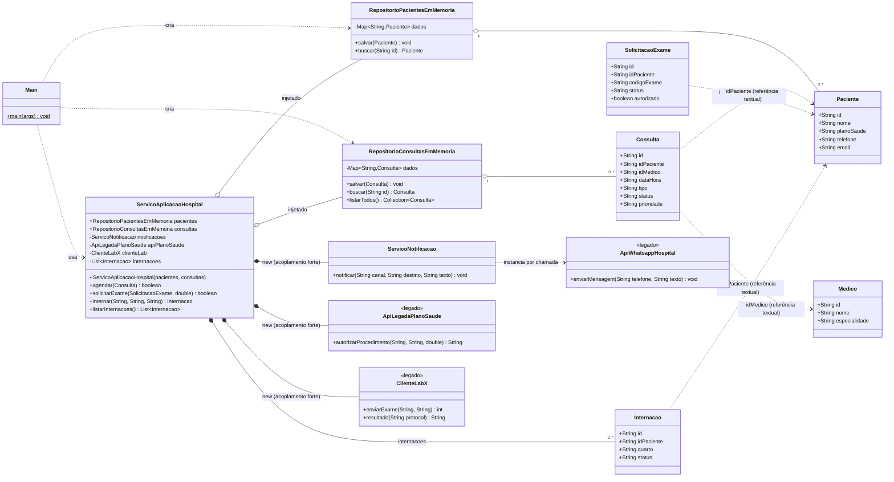

# Classes - visão atual

Diagrama coerente com o código em `src/main/java/br/edu/mediconnect`.
Classe central: **`ServicoAplicacaoHospital`** (camada de serviço / fachada de aplicação).

## Leitura do diagrama (pontos de design relevantes)

| Observação | Onde aparece |
| --- | --- |
| Repositórios são **classes concretas**, não interfaces — `ServicoAplicacaoHospital` depende de implementação. | `ServicoAplicacaoHospital:19-20` |
| `ServicoNotificacao`, `ApiLegadaPlanoSaude` e `ClienteLabX` são instanciados com `new` dentro do serviço (composição rígida, não injetável, difícil de testar). | `ServicoAplicacaoHospital:22-24` |
| `Medico` existe no modelo mas **não é usado** por nenhum repositório nem validado no agendamento. | `modelo/Medico.java` |
| `Internacao` é guardada em `List` interna, sem repositório próprio — assimetria em relação a `Paciente`/`Consulta`. | `ServicoAplicacaoHospital:25` |
| Associações entre entidades são feitas por `String` de id, sem navegabilidade nem integridade referencial. | `modelo/*.java` |
| `status` e `prioridade` são `String` livre em vez de enum — estados como `MANUAL` do plano se perdem. | `Consulta`, `SolicitacaoExame`, `Internacao` |
