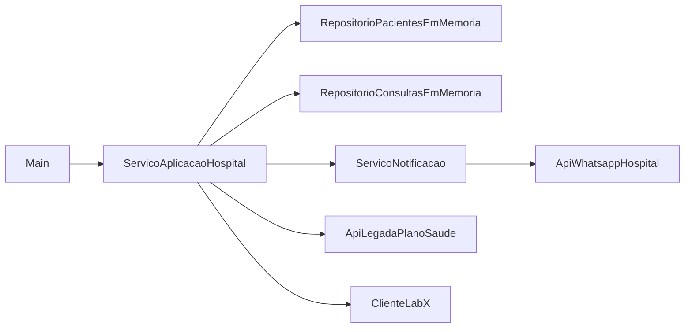

# Componentes - visão atual

```mermaid
flowchart LR
    Main[Main] --> App[ServicoAplicacaoHospital]
    App --> Pacientes[RepositorioPacientesEmMemoria]
    App --> Consultas[RepositorioConsultasEmMemoria]
    App --> Notify[ServicoNotificacao]
    App --> Health[ApiLegadaPlanoSaude]
    App --> Lab[ClienteLabX]
    Notify --> Msg[ApiWhatsappHospital]
```
