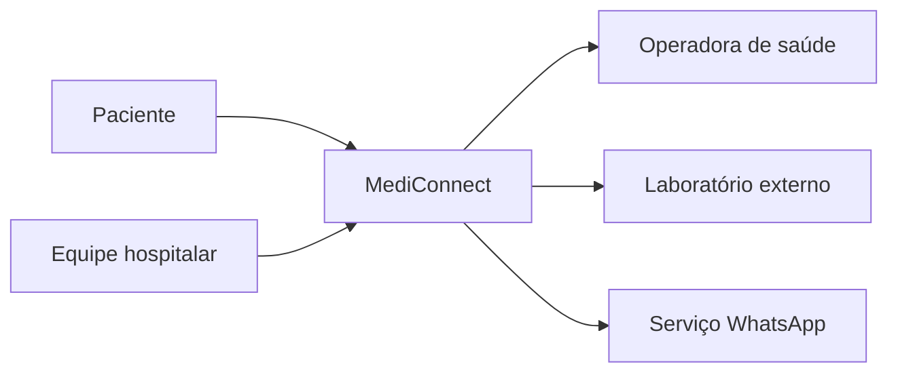

# Diagrama de contexto atual

```mermaid
flowchart LR
    P[Paciente] --> M[MediConnect]
    H[Equipe hospitalar] --> M
    M --> C[Operadora de saúde]
    M --> L[Laboratório externo]
    M --> W[Serviço WhatsApp]
```

O diagrama deve ser atualizado se atores ou sistemas externos mudarem.
