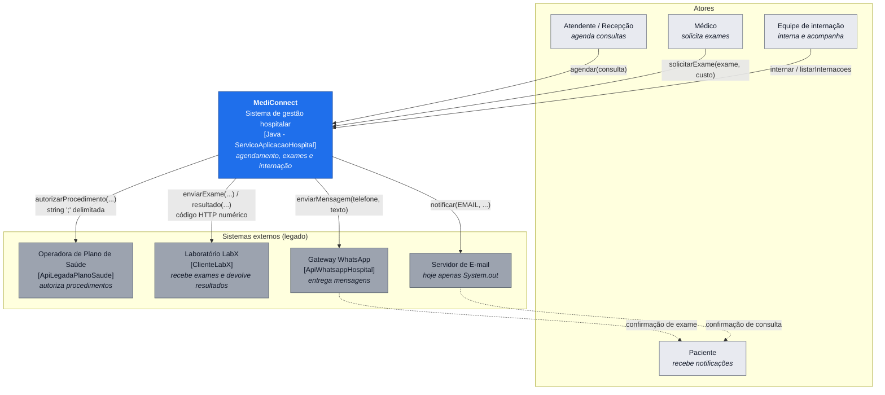

# Diagrama de contexto atual

Visão de nível de contexto (C4 - Nível 1): quem usa o MediConnect e com quais sistemas
externos ele conversa. O núcleo do sistema é a classe `ServicoAplicacaoHospital`.

## Fronteiras e responsabilidades

| Elemento | Dentro/Fora | Responsabilidade | Risco atual |
| --- | --- | --- | --- |
| `ServicoAplicacaoHospital` | Dentro | Orquestra agendamento, exame e internação | Concentra regra de negócio **e** conhecimento de protocolo externo |
| `ApiLegadaPlanoSaude` | Fora | Autorizar procedimento | Retorna `String` `"benef;proc;OK|MANUAL"`; o parsing vaza para o serviço |
| `ClienteLabX` | Fora | Receber exame / devolver resultado | Retorna `int` 200/400; sem tratamento de indisponibilidade |
| `ApiWhatsappHospital` | Fora | Enviar mensagem | Instanciado a cada envio, dentro de `ServicoNotificacao` |
| E-mail | Fora | Enviar mensagem | Ainda não integrado — apenas impressão em console |

O diagrama deve ser atualizado se atores ou sistemas externos mudarem
(ver `docs/contexto/sistemas-externos.md` e `docs/contexto/stakeholders.md`).
