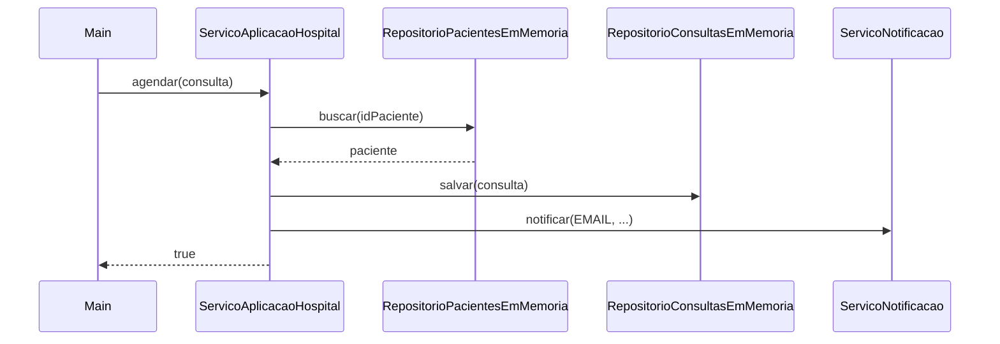

# Sequência - agendamento de consulta

```mermaid
sequenceDiagram
    participant Main
    participant App as ServicoAplicacaoHospital
    participant Pacientes as RepositorioPacientesEmMemoria
    participant Consultas as RepositorioConsultasEmMemoria
    participant Notify as ServicoNotificacao
    Main->>App: agendar(consulta)
    App->>Pacientes: buscar(idPaciente)
    Pacientes-->>App: paciente
    App->>Consultas: salvar(consulta)
    App->>Notify: notificar(EMAIL, ...)
    App-->>Main: true
```
