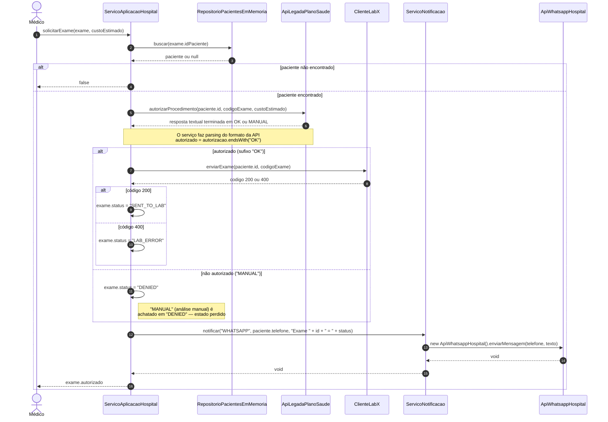

# Sequência - solicitação de exame

Fluxo do método `ServicoAplicacaoHospital.solicitarExame(SolicitacaoExame, double)`.
É o cenário mais completo do sistema: passa por persistência, integração com a operadora,
integração com o laboratório e notificação ao paciente.

## Observações do fluxo

1. **A solicitação nunca é persistida.** Não existe repositório de `SolicitacaoExame`; o objeto
   é mutado em memória e descartado ao fim da chamada.
2. **Retorno ambíguo:** `false` significa tanto "paciente inexistente" quanto "não autorizado".
   Quem chama não consegue distinguir os casos.
3. **`LAB_ERROR` retorna `true`,** pois o retorno é `exam.autorizado` e não o status final —
   o exame falhou no laboratório mas a operação é reportada como bem-sucedida.
4. **Sem tratamento de falha de integração:** qualquer exceção de `Plano` ou `Lab` sobe sem
   retry, timeout ou fallback.
5. **Notificação é síncrona e acoplada** ao fluxo de negócio; falha de envio derruba a operação.
